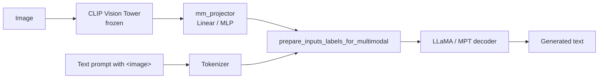
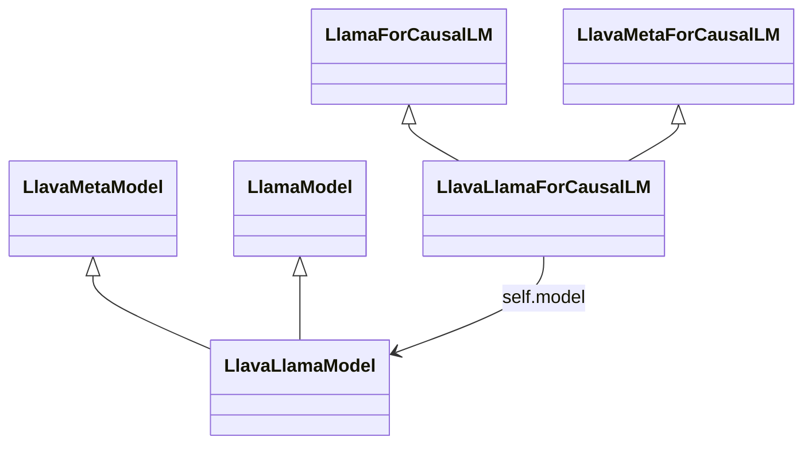
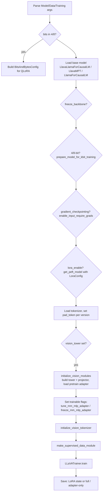
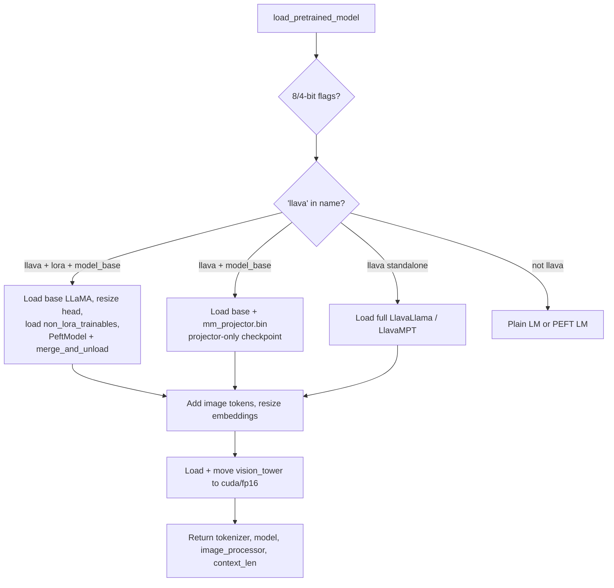
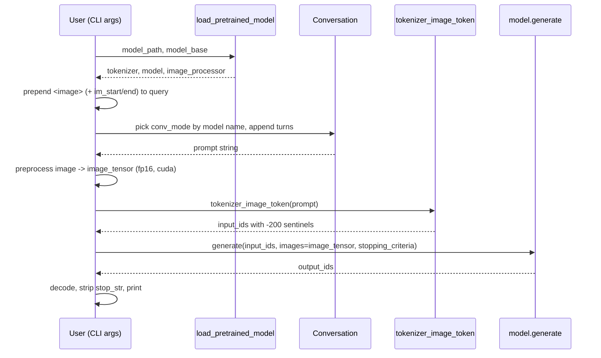
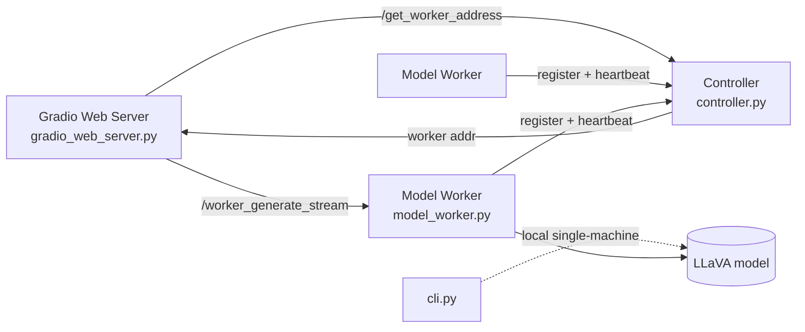
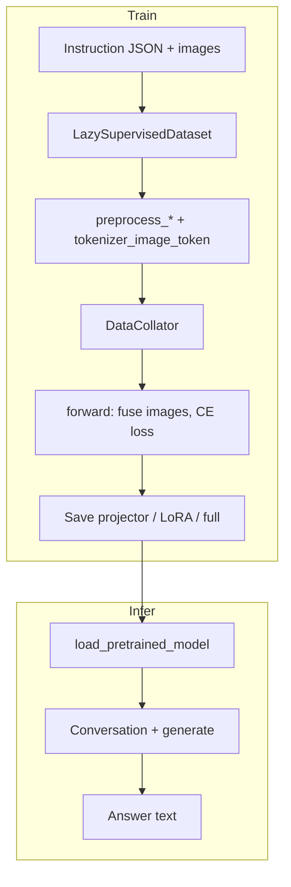

# LLaVA Codebase — Architecture & Code Flow

This document is a comprehensive walkthrough of how the LLaVA (Large Language and Vision Assistant) codebase is organized, how its components interact, and the end‑to‑end flows for **training**, **inference**, and **serving**. It is intended as an onboarding reference for developers working in this repository.

---

## 1. High‑Level Overview

LLaVA is a multimodal model that connects a **frozen CLIP vision encoder** to a **large language model (LLaMA/Vicuna or MPT)** through a small trainable **projection layer** (the "mm projector"). The core idea is simple:

1. An image is encoded into a sequence of patch feature vectors by CLIP.
2. A projector maps those vision features into the LLM's word‑embedding space.
3. The projected image tokens are spliced into the text token sequence in place of a special `<image>` placeholder.
4. The LLM then treats image tokens exactly like text tokens and autoregressively generates a response.



### Repository layout (key modules)

| Path | Responsibility |
|------|----------------|
| [llava/constants.py](../llava/constants.py) | Global constants: special token strings and the sentinel `IMAGE_TOKEN_INDEX = -200`, `IGNORE_INDEX = -100`. |
| [llava/conversation.py](../llava/conversation.py) | Prompt/chat templates and separator styles (`SINGLE`, `TWO`, `MPT`, `PLAIN`, `LLAMA_2`). |
| [llava/mm_utils.py](../llava/mm_utils.py) | Multimodal utilities: image tokenization, image processing, stopping criteria. |
| [llava/model/](../llava/model/) | Model definitions, vision encoder, projector, and loaders. |
| [llava/train/](../llava/train/) | Training entry points, dataset, collator, custom `Trainer`. |
| [llava/eval/](../llava/eval/) | Batch evaluation and single‑shot inference scripts. |
| [llava/serve/](../llava/serve/) | Distributed serving: controller, model worker, Gradio web UI, CLI. |
| [scripts/](../scripts/) | Shell launch scripts for pretraining and finetuning (full / LoRA / QLoRA). |

---

## 2. Model Architecture

### 2.1 Class hierarchy

The model is built by **mixing** LLaVA multimodal capabilities into a standard HuggingFace causal LM via multiple inheritance. Two abstract mixins in [llava/model/llava_arch.py](../llava/model/llava_arch.py) carry all the multimodal logic:

- `LlavaMetaModel` — owns the `vision_tower` and `mm_projector`; provides `initialize_vision_modules`.
- `LlavaMetaForCausalLM` — provides `encode_images`, `prepare_inputs_labels_for_multimodal`, and `initialize_vision_tokenizer`.

The concrete LLaMA variant in [llava/model/language_model/llava_llama.py](../llava/model/language_model/llava_llama.py) composes them:



`LlavaConfig` subclasses `LlamaConfig` with `model_type = "llava"`, and the module registers itself with HuggingFace Auto classes at import time:

```python
AutoConfig.register("llava", LlavaConfig)
AutoModelForCausalLM.register(LlavaConfig, LlavaLlamaForCausalLM)
```

An analogous MPT variant lives in [llava/model/language_model/llava_mpt.py](../llava/model/language_model/llava_mpt.py). Both are exported from [llava/model/__init__.py](../llava/model/__init__.py).

### 2.2 Vision tower

[llava/model/multimodal_encoder/clip_encoder.py](../llava/model/multimodal_encoder/clip_encoder.py) wraps a HuggingFace `CLIPVisionModel`:

- **Frozen**: `requires_grad_(False)` — CLIP weights are never trained.
- **`delay_load`**: when constructed during config‑only initialization, only the config is loaded; weights are pulled later via `load_model()` (saves memory when instantiating from a checkpoint).
- **`feature_select`**: picks a hidden layer (`mm_vision_select_layer`, typically `-2`) and, for `select_feature == 'patch'`, drops the CLS token (`hidden_states[:, 1:]`), yielding one embedding per image patch.

[llava/model/multimodal_encoder/builder.py](../llava/model/multimodal_encoder/builder.py) is a small factory that returns a `CLIPVisionTower` for `openai/...` or `laion/...` tower names.

### 2.3 The multimodal projector

By default the projector is a single `nn.Linear(mm_hidden_size -> hidden_size)` created in `LlavaMetaModel`. It is the **primary trainable bridge** during pretraining. (Newer configs may use an MLP; the builder in [llava/model/multimodal_projector/](../llava/model/multimodal_projector/) handles projector construction.)

### 2.4 The heart of the model: splicing image tokens

`prepare_inputs_labels_for_multimodal` in [llava/model/llava_arch.py](../llava/model/llava_arch.py) is where text and vision fuse. Given `input_ids` that contain the sentinel value `IMAGE_TOKEN_INDEX (-200)` wherever an image belongs, it:

1. Encodes images → `image_features` via `encode_images` (CLIP → projector).
2. For each sample, splits `input_ids` at every `IMAGE_TOKEN_INDEX`, embeds the surrounding text tokens with `embed_tokens`, and **concatenates** `[text_embeds, image_features, text_embeds, ...]` into a single `inputs_embeds` sequence.
3. Builds matching `labels` where the image‑feature span is filled with `IGNORE_INDEX (-100)` so loss is not computed on image positions.
4. Handles left/right padding of the attention mask and labels when fused sequences differ in length across the batch.
5. Returns `inputs_embeds` (with `input_ids` set to `None`) so the LLM consumes embeddings directly.

There is also a fast path: during autoregressive decoding after the first step (`input_ids.shape[1] == 1`), images are skipped and only the KV cache attention mask is extended.

> **Why a sentinel of `-200`?** It is deliberately out of the tokenizer's vocab range so it can never collide with a real token id. `tokenizer_image_token` (below) produces these values.

### 2.5 Vision token initialization

`initialize_vision_tokenizer` optionally adds `<im_patch>`, `<im_start>`, `<im_end>` special tokens and resizes embeddings. When adapter‑only tuning is enabled it selectively unfreezes/freezes input/output embeddings and can load embedding weights from a pretrained projector checkpoint.

---

## 3. Prompt & Conversation Handling

[llava/conversation.py](../llava/conversation.py) defines the `Conversation` dataclass, which accumulates `(role, message)` turns and renders them into a single prompt string via `get_prompt()`. Different model families need different formatting, encoded by `SeparatorStyle`:

- `SINGLE` / `TWO` — Vicuna‑style (`###` or two alternating separators).
- `LLAMA_2` — `[INST] ... [/INST]` wrapping with `<<SYS>>` system block.
- `MPT` — MPT chat format.
- `PLAIN` — used for pretraining (image + caption, minimal formatting).

When a message value is a `tuple` it carries `(text, PIL_image, image_process_mode)`; `get_images` / `get_prompt` know how to extract and (optionally) pad/resize the embedded image. Named templates are registered in `conv_templates` (e.g. `llava_v1`, `llava_v0`, `mpt`, `plain`, `vicuna_v1`) and a `default_conversation` is selected at runtime.

### Image‑aware tokenization

`tokenizer_image_token` in [llava/mm_utils.py](../llava/mm_utils.py) is the counterpart used everywhere text contains `<image>`:

1. Split the prompt on the literal `"<image>"` string.
2. Tokenize each text chunk normally.
3. Interleave the chunks with `IMAGE_TOKEN_INDEX`, producing a mixed id list where `-200` marks image positions.

This id list is later expanded into actual image embeddings by `prepare_inputs_labels_for_multimodal`.

---

## 4. Training Flow

### 4.1 Entry points

`scripts/*.sh` launch [llava/train/train_mem.py](../llava/train/train_mem.py) (which applies the LLaMA flash‑attention monkey patch from [llava/train/llama_flash_attn_monkey_patch.py](../llava/train/llama_flash_attn_monkey_patch.py) and then calls `train()`), via **DeepSpeed** with ZeRO configs in [scripts/zero2.json](../scripts/zero2.json) / [scripts/zero3.json](../scripts/zero3.json).

The real logic is `train()` in [llava/train/train.py](../llava/train/train.py). It parses three dataclasses with `HfArgumentParser`:

- `ModelArguments` — base model, `vision_tower`, `version`, `tune_mm_mlp_adapter`, `mm_use_im_*`, select layer/feature, pretrained projector path.
- `DataArguments` — `data_path`, `image_folder`, `image_aspect_ratio`, `lazy_preprocess`, `is_multimodal`.
- `TrainingArguments` (extends `transformers.TrainingArguments`) — LoRA flags (`lora_enable`, `lora_r`, ...), quantization `bits`, `freeze_mm_mlp_adapter`, etc.

### 4.2 Two‑stage training

LLaVA is trained in two stages, distinguished mainly by which parameters are trainable and the prompt `version`:

| Stage | Script | Trainable | `version` | Purpose |
|-------|--------|-----------|-----------|---------|
| **Pretrain (feature alignment)** | [scripts/pretrain.sh](../scripts/pretrain.sh) | `mm_projector` only (`tune_mm_mlp_adapter=True`, backbone frozen) | `plain` | Align CLIP features to LLM embedding space using image–caption pairs. |
| **Finetune (visual instruction tuning)** | [scripts/finetune.sh](../scripts/finetune.sh), [finetune_lora.sh](../scripts/finetune_lora.sh), [finetune_qlora.sh](../scripts/finetune_qlora.sh) | Full LLM, or LoRA/QLoRA adapters, plus projector | `v1` / `llava_v1` etc. | Teach the model to follow multimodal instructions. |

### 4.3 `train()` step‑by‑step



Key details:

- **Model loading** branches on `vision_tower` and `mpt` substring to pick the right class.
- **QLoRA**: when `bits in [4, 8]`, `prepare_model_for_kbit_training` is applied and LoRA layers are cast appropriately (norms → fp32, embeddings → bf16).
- **LoRA target modules** come from `find_all_linear_names` — every `nn.Linear` except `lm_head`.
- **`initialize_vision_modules`** attaches the frozen tower and the projector, sets config fields (`mm_hidden_size`, select layer/feature), and optionally loads a pretrained projector via `pretrain_mm_mlp_adapter`.
- The vision tower is moved to fp16; `data_args.image_processor` is wired from the tower so the dataset can preprocess images.

### 4.4 Dataset & preprocessing

`LazySupervisedDataset` in [llava/train/train.py](../llava/train/train.py) reads a JSON list of conversation records. Per `__getitem__`:

1. If the record has an `image`, open it, optionally `expand2square` pad it, and run `image_processor.preprocess`.
2. `preprocess_multimodal` normalizes the `<image>` placeholder position (moves it to the front, optionally wraps with `<im_start>/<im_end>` or `<Image>` mmtag).
3. `preprocess` dispatches to a per‑template tokenizer (`preprocess_v1`, `preprocess_llama_2`, `preprocess_mpt`, `preprocess_plain`, or the default). Each:
   - Renders the conversation with the template.
   - Tokenizes with `tokenizer_image_token` when an image is present.
   - Builds `labels` by **masking human/instruction tokens** with `IGNORE_INDEX`, so the loss only covers the assistant's response.
4. If the sample has no image but the model is multimodal, a zero image tensor is inserted so batching stays uniform.

`DataCollatorForSupervisedDataset` right‑pads `input_ids` (with `pad_token_id`) and `labels` (with `IGNORE_INDEX`), builds the attention mask, truncates to `model_max_length`, and stacks images (or keeps a list when shapes differ).

### 4.5 Forward & loss

During `Trainer` steps, `LlavaLlamaForCausalLM.forward`:

1. Calls `prepare_inputs_labels_for_multimodal` to fuse images into `inputs_embeds` and adjust `labels`/mask.
2. Runs the LLaMA decoder on `inputs_embeds`.
3. Computes shifted cross‑entropy loss (`CrossEntropyLoss`) over the vocabulary, ignoring `IGNORE_INDEX` positions.

### 4.6 Which tokens compute the loss (worked examples)

A recurring source of confusion is **what the model predicts** vs. **what is scored by the loss**. These are different:

- **Forward pass (autoregressive):** the causal LM *always* emits a next‑token prediction at **every** position. This is inherent to the architecture and cannot be turned off per token.
- **Loss:** cross‑entropy is applied **only** where `labels != IGNORE_INDEX (-100)`. With the causal shift (`logits[..., :-1]` vs `labels[..., 1:]`), the position immediately before a supervised token is where its prediction is scored.

Two universal rules across both stages:

1. The `<image>` placeholder (`IMAGE_TOKEN_INDEX = -200`) expands to **576** image‑feature embeddings (CLIP ViT‑L/14‑336 → $(336/14)^2 = 576$ patches), and those positions get **576 `-100` labels** — images are **never** scored.
2. Padding is masked with `-100`.

#### Stage 1 — Pretraining (`plain`): only the caption is scored

Pretraining uses `preprocess_plain`, which **discards the human instruction entirely** (it overwrites the whole first turn with just `<image>`) and supervises only the caption.

Example record:

```json
{"conversations": [
  {"from": "human", "value": "Provide a brief description of the given image.\n<image>"},
  {"from": "gpt",   "value": "olive oil is a healthy ingredient used liberally ."}
]}
```

Transformation (`source[0]['value']` is replaced by `<image>`; instruction text is dropped):

```
sequence :  <s>   <image ×576>   olive oil is a healthy ingredient used liberally . \n
labels   : -100    -100 ×576     olive oil is a healthy ingredient used liberally . \n
             └──────── masked ────────┘   └──────────────── loss computed here ─────────────┘
```

- **Scored (loss):** the caption tokens `olive oil is a healthy ingredient used liberally .` plus the trailing separator.
- **Masked (`-100`):** `<s>`, the 576 image tokens, and — notably — the **entire instruction** `Provide a brief description of the given image.` (it is not even present in the sequence).
- **Updated params:** only `mm_projector`. The loss signal comes from the caption positions and backpropagates through the frozen LLM to the projector.

#### Stage 2 — Finetuning (`vicuna_v1`): only assistant answers are scored

Finetuning uses `preprocess_v1`. The instruction is **kept** in the sequence (so the model can condition on it) but **masked** in the labels; only assistant answers (and their closing `</s>`) are scored. Multi‑turn samples are combined into **one** sequence, with each turn masked independently.

Example record (multi‑turn):

```json
{"conversations": [
  {"from": "human", "value": "<image>\nWhat are the colors of the bus in the image?"},
  {"from": "gpt",   "value": "The bus in the image is white and red."},
  {"from": "human", "value": "What feature can be seen on the back of the bus?"},
  {"from": "gpt",   "value": "The back of the bus features an advertisement."}
]}
```

Rendered as one string and masked:

```
tokens:  <s> [system] USER: <image ×576>\nWhat are the colors...? ASSISTANT: The bus...red.</s> USER: ...back of the bus? ASSISTANT: The back...advertisement.</s>
labels:  -100  -100   -100     -100 ×576   -100...              -100      The bus...red.</s> -100  -100...              -100      The back...advertisement.</s>
                     └────────────────── masked ──────────────────┘       └──── loss ────┘                                       └──── loss ────┘
```

Per‑turn breakdown:

| Segment | Label | Scored? |
|---------|-------|---------|
| `<s>` + system prompt | `-100` | No |
| `USER:` + question text | `-100` | No |
| `<image>` → 576 patch embeds | `-100` | No |
| `ASSISTANT: ` role tag | `-100` | No |
| **assistant answer text** | real ids | **Yes** |
| **`</s>` after each answer** | real id | **Yes** (teaches the model when to stop) |

Key masking mechanics in `preprocess_v1`:

```python
sep = conv.sep + conv.roles[1] + ": "     # " ASSISTANT: "
rounds = conversation.split(conv.sep2)    # split by "</s>" -> one USER→ASSISTANT exchange per round
for rou in rounds:
    parts = rou.split(sep)                # [ question part , answer part ]
    parts[0] += sep                       # instruction INCLUDES "ASSISTANT: "
    instruction_len = len(tokenizer_image_token(parts[0], tokenizer)) - 2
    target[cur_len : cur_len + instruction_len] = IGNORE_INDEX   # mask question + role tag
    cur_len += round_len
```

#### Summary

| | Pretraining (`plain`) | Finetuning (`vicuna_v1`) |
|---|---|---|
| Instruction text | **discarded** | kept (as masked context) |
| Scored by loss | image caption | assistant answers (+ `</s>`) |
| Image tokens | masked | masked |
| System prompt | (none) | masked |
| Trainable params | `mm_projector` only | full LLM (or LoRA) **+** `mm_projector` |

The common thread: **loss is computed only on the text the model is meant to *generate*** — the caption in pretraining, the assistant's replies in finetuning — while images, prompts, and template scaffolding are masked context.

### 4.7 Custom trainer & checkpointing

`LLaVATrainer` in [llava/train/llava_trainer.py](../llava/train/llava_trainer.py) overrides saving so that when only the adapter is tuned (`tune_mm_mlp_adapter`), checkpoints save **just** the `mm_projector` (and optionally embeddings) as `mm_projector.bin`, rather than the whole model. DeepSpeed ZeRO‑3 partitioned params are gathered via `maybe_zero_3` before saving. At the end of `train()`:

- **LoRA runs** save `adapter` weights via `get_peft_state_maybe_zero_3` plus `non_lora_trainables.bin`.
- **Full runs** call `safe_save_model_for_hf_trainer`.

---

## 5. Model Loading for Inference

`load_pretrained_model` in [llava/model/builder.py](../llava/model/builder.py) is the single entry point used by every inference/serving path. It resolves several checkpoint layouts:



Highlights:

- **LoRA + base**: instantiate the base model with the LoRA config, patch `lm_head`/`embed_tokens` sizes if token count changed, load `non_lora_trainables.bin`, then wrap with `PeftModel` and `merge_and_unload()` to fold LoRA into the base weights.
- **Projector‑only**: load base model, then `mm_projector.bin` (cast to fp16) via `load_state_dict(..., strict=False)`.
- Adds `<im_patch>` / `<im_start>` / `<im_end>` to the tokenizer per config flags and resizes embeddings.
- Ensures the (delayed) vision tower is loaded and moved to `cuda`/fp16, and returns its `image_processor`.
- Returns `(tokenizer, model, image_processor, context_len)`.

---

## 6. Inference Flow (single‑shot)

[llava/eval/run_llava.py](../llava/eval/run_llava.py) shows the minimal CLI inference path:



Steps:
1. `disable_torch_init()` skips expensive default weight init ([llava/utils.py](../llava/utils.py)).
2. Build the query string, prepending the image token(s) depending on `mm_use_im_start_end`.
3. Choose the conversation template from the model name (`v1` → `llava_v1`, `mpt` → `mpt`, else `llava_v0`).
4. Preprocess the image to a fp16 CUDA tensor.
5. Tokenize with `tokenizer_image_token` → `input_ids` containing `-200`.
6. Build `KeywordsStoppingCriteria` from the template's stop string.
7. `model.generate(..., images=image_tensor, ...)`. On the **first** decoding step, `prepare_inputs_for_generation` passes `images` through and `forward` fuses them; on later steps only the last token is fed and images are skipped.
8. Decode the new tokens, strip the stop string, print.

`KeywordsStoppingCriteria` (in [llava/mm_utils.py](../llava/mm_utils.py)) stops generation when the tail of `output_ids` matches a keyword id sequence or the decoded tail contains a stop keyword.

The batch evaluators [llava/eval/model_vqa.py](../llava/eval/model_vqa.py), [model_vqa_science.py](../llava/eval/model_vqa_science.py), and [model_qa.py](../llava/eval/model_qa.py) follow the same recipe over a dataset of questions, writing JSONL answers that downstream GPT‑review scripts (`eval_gpt_review*.py`, `eval_science_qa*.py`, `summarize_gpt_review.py`) grade.

---

## 7. Serving Architecture (distributed web demo)

The `llava/serve/` package implements a small distributed inference system (adapted from FastChat):



### 7.1 Controller — [llava/serve/controller.py](../llava/serve/controller.py)
A FastAPI service that tracks registered workers (`WorkerInfo`), receives heartbeats, expires stale workers, and dispatches client requests to a worker by `LOTTERY` (speed‑weighted random) or `SHORTEST_QUEUE`. Endpoints include `/register_worker`, `/receive_heart_beat`, `/get_worker_address`, `/list_models`.

### 7.2 Model worker — [llava/serve/model_worker.py](../llava/serve/model_worker.py)
Loads a model via `load_pretrained_model`, registers with the controller, and runs a background heartbeat thread. Its `/worker_generate_stream` endpoint:

1. Reconstructs the prompt and decodes base64 images; computes `num_image_tokens`.
2. Builds `input_ids` with `tokenizer_image_token`, sets up `KeywordsStoppingCriteria` and a `TextIteratorStreamer`.
3. Clamps `max_new_tokens` against the model context length minus prompt and image tokens.
4. Runs `model.generate` in a background `Thread` and **streams** decoded text chunks back as newline‑delimited JSON, trimming the stop string.
5. `generate_stream_gate` wraps this with error handling for `ValueError` / CUDA errors.

### 7.3 Web UI & CLI
- [llava/serve/gradio_web_server.py](../llava/serve/gradio_web_server.py) — chat UI that asks the controller for a worker and streams tokens for display.
- [llava/serve/cli.py](../llava/serve/cli.py) — single‑machine interactive terminal chat, no controller needed.
- [llava/serve/register_worker.py](../llava/serve/register_worker.py) / [test_message.py](../llava/serve/test_message.py) — helper utilities.

---

## 8. End‑to‑End Data Path Summary



The unifying contract across training and inference is:

1. **Text with `<image>`** → `tokenizer_image_token` → **ids containing `-200`**.
2. **`prepare_inputs_labels_for_multimodal`** replaces every `-200` with projected CLIP features to form `inputs_embeds`.
3. The **LLM** consumes `inputs_embeds` and produces text — training computes loss on assistant tokens only; inference decodes autoregressively.

---

## 9. Key Constants & Conventions

| Symbol | Value | Meaning |
|--------|-------|---------|
| `IMAGE_TOKEN_INDEX` | `-200` | Sentinel id marking where image features are spliced in. |
| `IGNORE_INDEX` | `-100` | Label value excluded from loss (image spans, human turns, padding). |
| `DEFAULT_IMAGE_TOKEN` | `<image>` | Placeholder string in raw prompts. |
| `DEFAULT_IM_START_TOKEN` / `DEFAULT_IM_END_TOKEN` | `<im_start>` / `<im_end>` | Optional wrappers around image tokens. |
| `DEFAULT_IMAGE_PATCH_TOKEN` | `<im_patch>` | Per‑patch placeholder token. |

**Model naming conventions** drive behavior: the substrings `llava`, `lora`, and `mpt` in a model name/path select loader branches and conversation templates throughout `builder.py`, `run_llava.py`, and `model_worker.py`.

---

## 10. Where to Start When Modifying

| Goal | Files to touch |
|------|----------------|
| Change how images fuse into text | `prepare_inputs_labels_for_multimodal` in [llava/model/llava_arch.py](../llava/model/llava_arch.py) |
| Swap the vision encoder | [llava/model/multimodal_encoder/](../llava/model/multimodal_encoder/) + `build_vision_tower` |
| Change the projector | [llava/model/multimodal_projector/](../llava/model/multimodal_projector/) + `initialize_vision_modules` |
| Add a new chat template | [llava/conversation.py](../llava/conversation.py) (`conv_templates`) + a `preprocess_*` in [llava/train/train.py](../llava/train/train.py) |
| Adjust training/LoRA behavior | [llava/train/train.py](../llava/train/train.py), [llava/train/llava_trainer.py](../llava/train/llava_trainer.py), [scripts/](../scripts/) |
| Change inference/serving | [llava/eval/run_llava.py](../llava/eval/run_llava.py), [llava/serve/model_worker.py](../llava/serve/model_worker.py) |

<!--
  Mermaid renderer for converted HTML.
  Most static Markdown->HTML converters do NOT render ```mermaid blocks; they emit
  <pre><code class="language-mermaid">...</code></pre> and show the raw source.
  The script below loads Mermaid from a CDN, turns those code blocks into diagrams,
  and renders them. Requires the converter to (a) pass raw HTML through and (b) the
  viewer to have internet access for the CDN. If your converter strips <script>,
  see the note under the script for a wrapper-HTML alternative.
-->
<script type="module">
  import mermaid from "https://cdn.jsdelivr.net/npm/mermaid@11/dist/mermaid.esm.min.mjs";

  // Convert fenced ```mermaid code blocks into <div class="mermaid"> containers.
  const blocks = document.querySelectorAll(
    'pre > code.language-mermaid, code.language-mermaid, pre.language-mermaid, pre.mermaid > code'
  );
  blocks.forEach((code) => {
    const source = code.textContent;
    const host = code.closest("pre") || code;
    const div = document.createElement("div");
    div.className = "mermaid";
    div.textContent = source;
    host.replaceWith(div);
  });

  mermaid.initialize({ startOnLoad: false, securityLevel: "loose", theme: "default" });
  await mermaid.run({ querySelector: ".mermaid" });
</script>

> **If your converter strips `<script>` tags** (common for security), the block above
> will be removed and diagrams won't render. In that case, wrap the converted body in
> a small HTML shell that includes Mermaid, e.g.:
>
> ```html
> <!doctype html>
> <html>
>   <head><meta charset="utf-8"></head>
>   <body>
>     <!-- paste the converted HTML of this document here -->
>     <script type="module">
>       import mermaid from "https://cdn.jsdelivr.net/npm/mermaid@11/dist/mermaid.esm.min.mjs";
>       document.querySelectorAll('code.language-mermaid').forEach((code) => {
>         const div = document.createElement('div');
>         div.className = 'mermaid';
>         div.textContent = code.textContent;
>         (code.closest('pre') || code).replaceWith(div);
>       });
>       mermaid.initialize({ startOnLoad: false });
>       await mermaid.run();
>     </script>
>   </body>
> </html>
> ```
